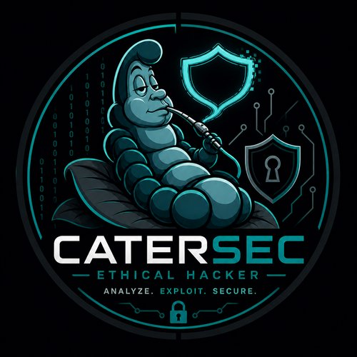

<!-- Avatar / Header -->

  

<h1 align="center">CaterSec — Ethical Hacker / ASIR Student</h1>

  Portable Cyberdeck (Raspberry Pi 5) • Pentesting • Infra & DevSecOps • IoT / Hardware hacking

<!-- Badges profesionales -->

  
  
  
  

---

## 🔭 Sobre mí
Soy CaterSec, estudiante de ciberseguridad y desarrolladora de soluciones portátiles de auditoría (Ciberdeck “KrakenAnzen”). Me especializo en pentesting, automatización con scripts y despliegue de infraestructura segura.

- 🛠 **Tecnologías:** Kali Linux, Docker, Python, Bash, Git, Netdata, Portainer.
- 🔐 **Enfoque:** Seguridad ofensiva, hardening de sistemas y automatización de procesos.
- 🧩 **Proyecto destacado:** [catersecCyberdeck](https://github.com/CaterSec/catersecCyberdeck) (Ciberdeck Raspberry Pi 5).

---

## 📸 Galería Técnica

  
  
  

---

## 📫 Contacto
Si quieres contactar conmigo para hablar de ciberseguridad o proyectos:
- 📧 Email: catersec@hotmail.com

---

Gracias por visitar mi perfil.

